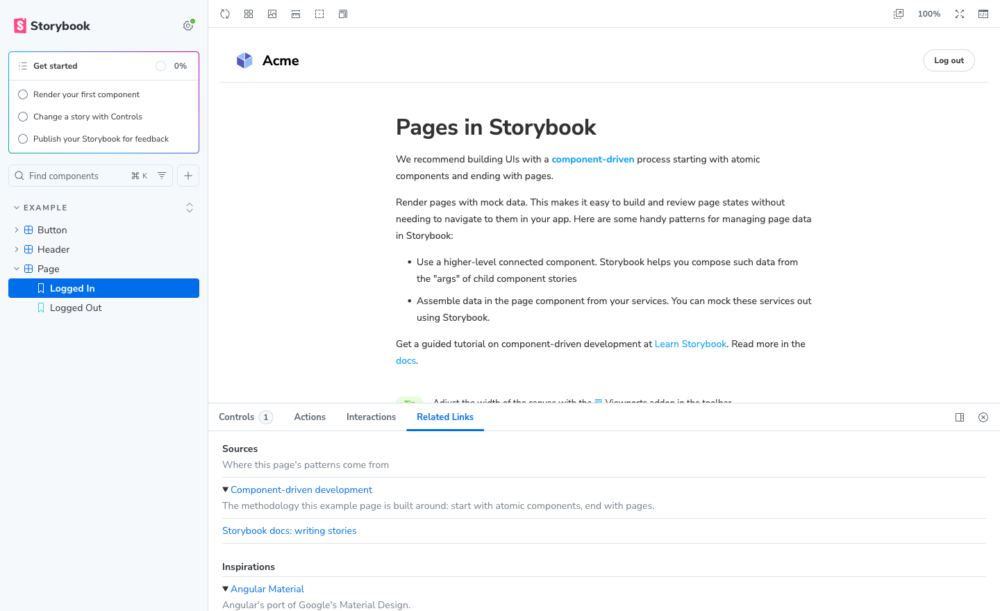

# Storybook Addon Related Links

Add related links to your stories. Useful for pointing at the resources behind a component: design sources, inspirations, docs to study, tickets, anything worth one click.

Links show up in a **Related Links** panel next to Controls and Actions, per story.



## Compatibility

| Addon  | Storybook  |
| ------ | ---------- |
| 1.x    | 10.x       |
| 0.0.x  | 6.5.x      |

Storybook 10 is ESM-only, so this addon ships ESM-only from 1.0.0. If you are still on Storybook 6.5, stay on `0.0.4`.

## Install

```bash
npm install --save-dev storybook-addon-related-links
```

Register it in `.storybook/main.ts`:

```ts
import type { StorybookConfig } from "@storybook/react-vite";

const config: StorybookConfig = {
  stories: ["../src/**/*.stories.@(js|jsx|ts|tsx)"],
  addons: ["storybook-addon-related-links"],
  framework: { name: "@storybook/react-vite", options: {} },
};

export default config;
```

The addon reads parameters only, so it works with any renderer — React, Angular, Vue, Svelte, Web Components, HTML.

## Usage

Add a `relatedLinks` parameter to a story, a component, or your whole preview:

```js
export const Primary = {
  parameters: {
    relatedLinks: {
      sections: [
        {
          title: "Links to study",
          description: "Read these before changing the component",
          links: [
            {
              text: "Angular Material",
              url: "https://material.angular.io",
              description:
                "This component is heavily inspired by Angular Material, Google's Material Design port for Angular.",
            },
            {
              text: "Storybook docs: args",
              url: "https://storybook.js.org/docs/writing-stories/args",
            },
          ],
        },
      ],
    },
  },
};
```

Links with a `description` render as a collapsible row; links without one render as a plain link.

Put the parameter on the default export to cover every story of a component, or in `.storybook/preview.ts` to cover every story in the project. Storybook merges parameters most-specific-first, and arrays are replaced rather than concatenated, so a story-level `sections` array wins over a component-level one.

### Parameters

`relatedLinks`

| Property   | Type              | Required | Description                    |
| ---------- | ----------------- | -------- | ------------------------------ |
| `sections` | `Section[]`       | yes      | Groups of links, rendered in order |

`Section`

| Property      | Type      | Required | Description                                   |
| ------------- | --------- | -------- | --------------------------------------------- |
| `title`       | `string`  | no       | Heading for the group                         |
| `description` | `string`  | no       | Short line under the heading                  |
| `links`       | `Link[]`  | yes      | The links in this group                       |

`Link`

| Property      | Type      | Required | Description                                         |
| ------------- | --------- | -------- | --------------------------------------------------- |
| `text`        | `string`  | yes      | Link label                                          |
| `url`         | `string`  | yes      | Destination, opened in a new tab                    |
| `description` | `string`  | no       | Longer explanation; makes the row collapsible       |

TypeScript users can import the types:

```ts
import type {
  RelatedLink,
  RelatedLinksSection,
  RelatedLinksParameters,
} from "storybook-addon-related-links";
```

### CSF Factories

On CSF Factories (CSF Next), add the addon to your preview to get a typed `relatedLinks` parameter:

```ts
// .storybook/preview.ts
import { definePreview } from "@storybook/react-vite";
import relatedLinks from "storybook-addon-related-links/preview";

export default definePreview({
  addons: [relatedLinks()],
});
```

## Upgrading from 0.0.x

Storybook 11 removes the `TAB` addon type, so the links moved out of their own tab and into the addon panel. The `relatedLinks` parameter is unchanged — no story edits needed. What changed:

- peer dependency is now `storybook@^10`, replacing the `@storybook/*` peers
- the `/related-links/:storyId` route is gone; open the **Related Links** panel instead
- the package is ESM-only

## Development

```bash
npm install
npm start          # builds in watch mode and runs the local Storybook
npm run check      # type check
npm run build      # build the addon
```

The example stories in `stories/` double as the manual test bed: `Example/Page` shows multiple sections, `Example/Button → Small` shows a collapsible description, and `Example/Header` shows the empty state.

## Releasing

Releases are cut by hand from a clean `main`:

```bash
npm version <major|minor|patch>
npm publish
git push --follow-tags
gh release create "v$(node -p "require('./package.json').version")" --generate-notes
```

## Connect with me

[](https://twitch.tv/codewithahsan)
[](https://www.github.com/ahsanayaz)
[](https://www.linkedin.com/in/ahsanayaz)
[](https://twitter.com/codewith_ahsan)
[](https://instagram.com/codewithahsan)
[](https://facebook.com/codewithahsan)
[](https://www.tiktok.com/@codewithahsan)
[](https://discord.gg/rEBSSh926k)
